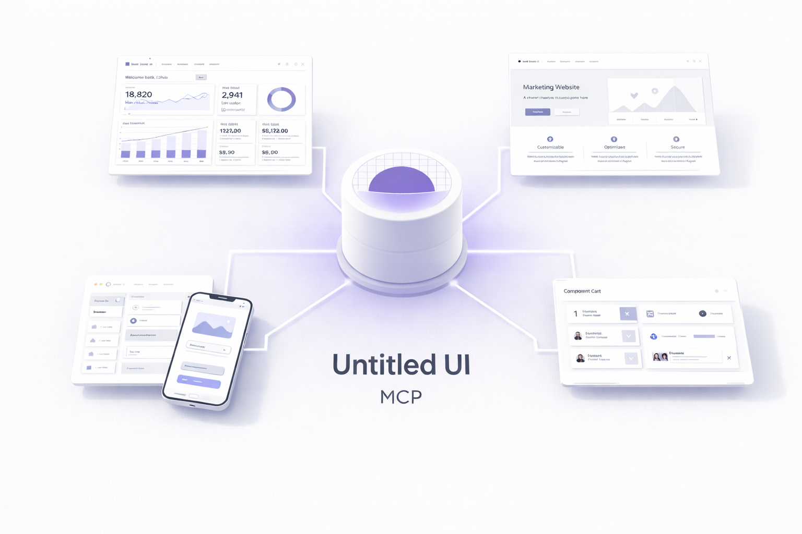

# UntitledUI MCP



MCP server that lets AI agents fetch real UntitledUI components instead of generating UI from scratch.

## Why

AI tools can generate functional UI, but the result often lacks the polish and consistency of professionally designed systems. UntitledUI is one of the most refined component libraries available — this MCP gives your AI direct access to it.

Instead of generating a modal from patterns it's seen, your AI fetches the actual UntitledUI modal with all its carefully crafted details intact.

## Quick Start

### 1. Start with a UntitledUI Starter Kit

UntitledUI components require specific Tailwind configuration, design tokens, and providers. The easiest way to get started is with an official starter kit:

**Next.js:**
```bash
git clone https://github.com/untitleduico/untitledui-nextjs-starter-kit my-app
cd my-app && npm install
```

**Vite:**
```bash
git clone https://github.com/untitleduico/untitledui-vite-starter-kit my-app
cd my-app && npm install
```

These starter kits come pre-configured with:
- Tailwind CSS with all UntitledUI design tokens
- Theme provider for light/dark mode
- Toast notifications
- Routing setup
- All required dependencies

### 2. Add the MCP Server

**Claude Code:**
```bash
claude mcp add untitledui -- npx untitledui-mcp
```

**Cursor / VS Code** — add to `.cursor/mcp.json`:
```json
{
  "mcpServers": {
    "untitledui": {
      "command": "npx",
      "args": ["-y", "untitledui-mcp"]
    }
  }
}
```

This gives you access to **base components** (button, input, select, avatar, badge, etc.) without authentication.

### 3. Authenticate for Pro Components (optional)

To access application components (modals, sidebars, tables, dashboards) and marketing sections, authenticate with your UntitledUI Pro license:

```bash
npx untitledui@latest login
```

This opens your browser to authenticate and saves your license key to `~/.untitledui/config.json`. The MCP auto-detects this file.

Alternatively, set the key manually in your MCP config:
```json
{
  "mcpServers": {
    "untitledui": {
      "command": "npx",
      "args": ["-y", "untitledui-mcp"],
      "env": {
        "UNTITLEDUI_LICENSE_KEY": "<your-key>"
      }
    }
  }
}
```

### 4. Verify Setup

```bash
npx untitledui-mcp --test
```

## Recommended Workflow

1. **Start with a starter kit** — Don't try to add UntitledUI components to an existing project without the proper Tailwind setup. The starter kits handle all configuration.

2. **Ask your AI to fetch components** — Once your project is set up, ask your AI to add specific components:
   - "Add a settings modal"
   - "I need a sidebar navigation"
   - "Add the user profile dropdown"

3. **Build complete pages from examples** — For larger features, start with a page template:
   - "Show me available dashboard templates"
   - "Fetch the landing page example"

## Available Tools

Your AI gets these tools:

| Tool | What it does |
|------|--------------|
| `search_components` | Find components by name or description |
| `list_components` | Browse a category |
| `get_component_with_deps` | Fetch component + all dependencies |
| `get_component` | Fetch component only |
| `get_component_file` | Fetch a single file (for large components) |
| `list_examples` | Browse available page templates |
| `get_example` | Fetch a complete page template |

## What You Can Do

### Recreate Any UI from a Screenshot

```
You: [paste screenshot] "Recreate this with UntitledUI components"

AI analyzes the design → identifies matching components
AI fetches sidebar, header, cards, tables → all with dependencies
AI assembles → production-ready page matching your screenshot
```

### Build Complete Pages in Seconds

```
You: "Build me a SaaS pricing page with 3 tiers and a FAQ section"

AI fetches marketing/pricing-sections + marketing/faq-sections
AI combines components → complete pricing page with toggle for monthly/annual
Result: Professional pricing page with all interactions working
```

### Set Up Your Entire App Shell

```
You: "Set up the main app layout with collapsible sidebar and header with user dropdown"

AI fetches application/sidebars + application/headers + base components
AI wires up navigation state, theme toggle, user menu
Result: Complete app shell ready for your content
```

### Clone a Page from UntitledUI's Templates

```
You: "I want a dashboard like the one in dashboards-01"

AI calls get_example { path: "application/dashboards-01/01" }
→ Returns 27 files: page layout, charts, tables, cards, all base components
→ Ready to customize with your data
```

### Mix and Match Components

```
You: "Create a settings page with sections for profile, notifications, billing, and team members"

AI searches → finds matching components for each section
AI fetches settings panels, forms, tables, modals
AI composes → cohesive settings page with consistent styling
```

### Rapid Feature Development

```
You: "Add a command palette like Linear/Notion with keyboard shortcut"

AI fetches application/command-menus
→ Complete command palette with search, keyboard navigation, sections
→ Just wire up your actions
```

## Response Format

```json
{
  "primary": {
    "name": "settings-modal",
    "files": [{ "path": "settings-modal.tsx", "code": "..." }],
    "baseComponents": ["button", "input", "select"]
  },
  "baseComponents": [
    { "name": "button", "files": [...] },
    { "name": "input", "files": [...] }
  ],
  "allDependencies": ["@headlessui/react", "clsx"],
  "estimatedTokens": 12500,
  "fileList": [
    { "path": "settings-modal.tsx", "tokens": 850 },
    { "path": "button/button.tsx", "tokens": 420 }
  ]
}
```

Responses include token estimates to help AI agents manage context limits. For very large responses (>25K tokens), the AI can use `get_component_file` to fetch individual files.

## Troubleshooting

### Components don't look right / missing styles

UntitledUI components use custom Tailwind classes like `bg-primary`, `text-display-md`, and design tokens that aren't part of standard Tailwind.

**Solution:** Use a [UntitledUI starter kit](#1-start-with-a-untitledui-starter-kit). The starter kits include all required Tailwind configuration and design tokens.

### Import errors for base components

Pro components depend on base components (button, input, etc.). When fetching a component with `get_component_with_deps`, all dependencies are included automatically.

**Solution:** Make sure you're using `get_component_with_deps` instead of `get_component` for Pro components.

## Requirements

- Node.js 18+
- UntitledUI Pro license (for Pro components only)

## Credits

[UntitledUI](https://www.untitledui.com?utm_source=untitledui-mcp&utm_medium=github&utm_campaign=readme) is created by [Jordan Hughes](https://jordanhughes.co?utm_source=untitledui-mcp&utm_medium=github&utm_campaign=readme).

- [Twitter/X](https://x.com/jordanphughes)
- [Dribbble](https://dribbble.com/jordanhughes)
- [UntitledUI on X](https://x.com/UntitledUI)
- [Get UntitledUI Pro](https://www.untitledui.com/pricing?utm_source=untitledui-mcp&utm_medium=github&utm_campaign=readme)

## License

MIT
